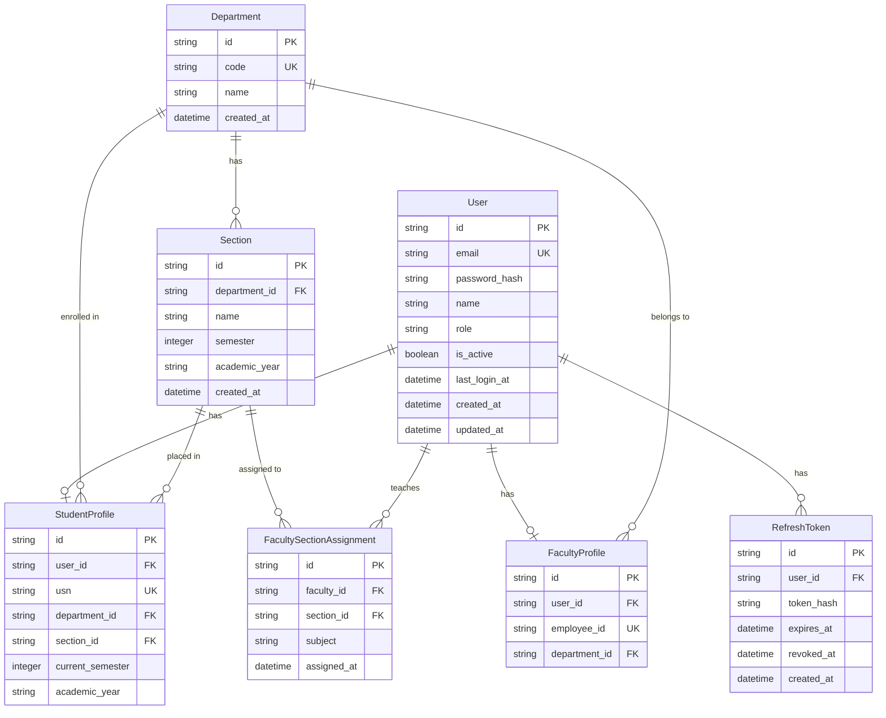
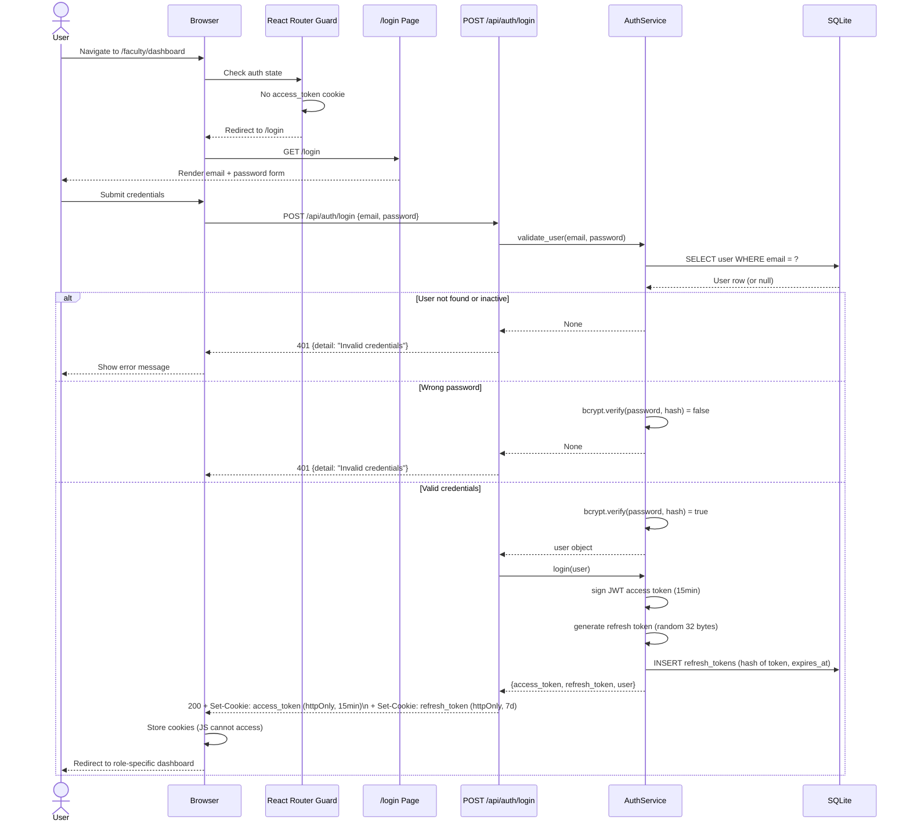
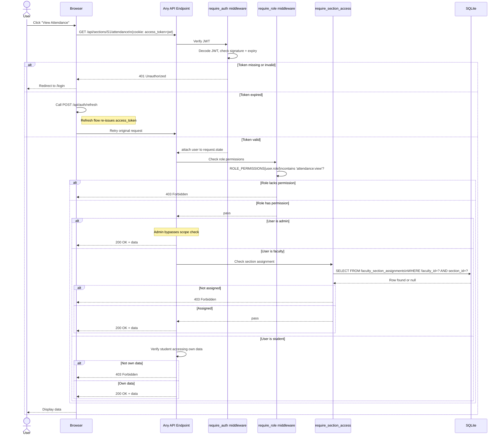
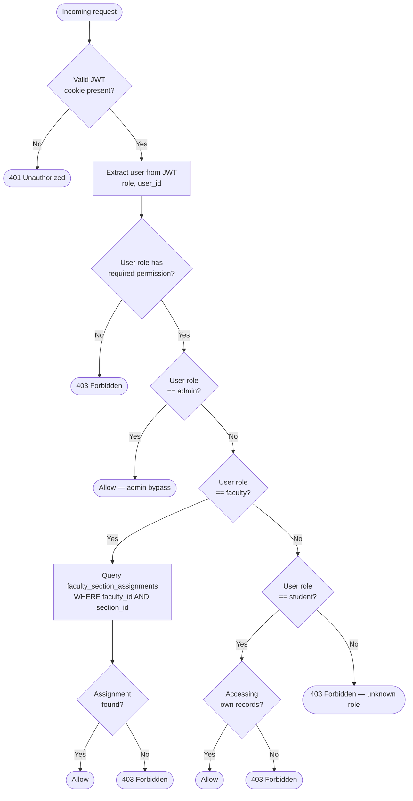
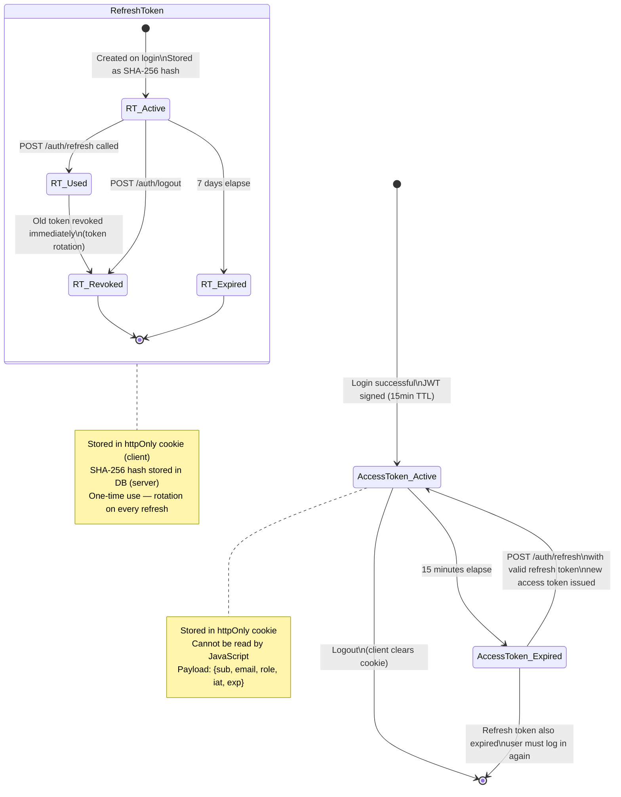
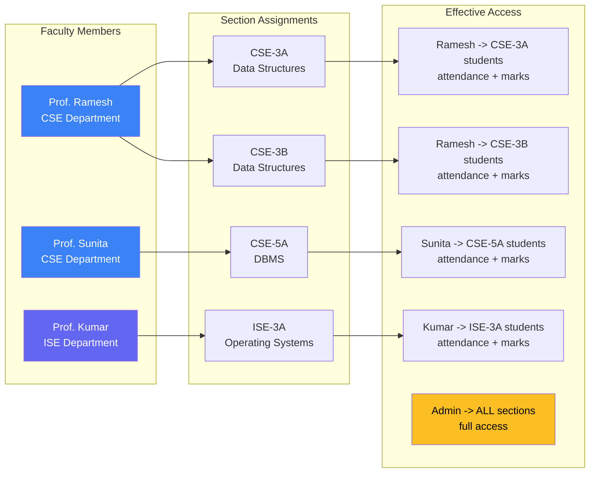
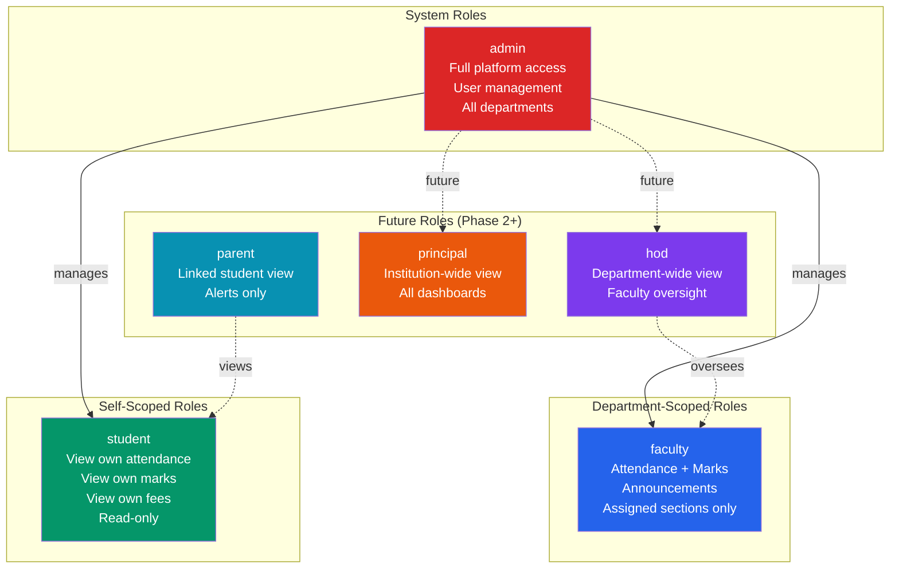
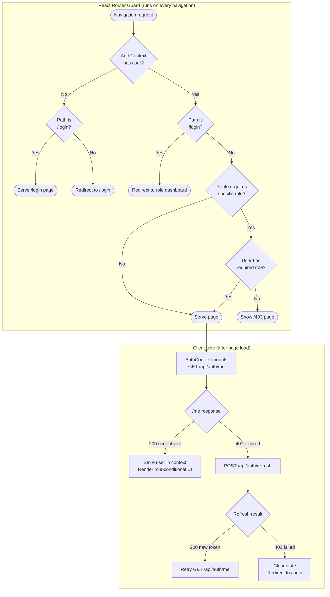
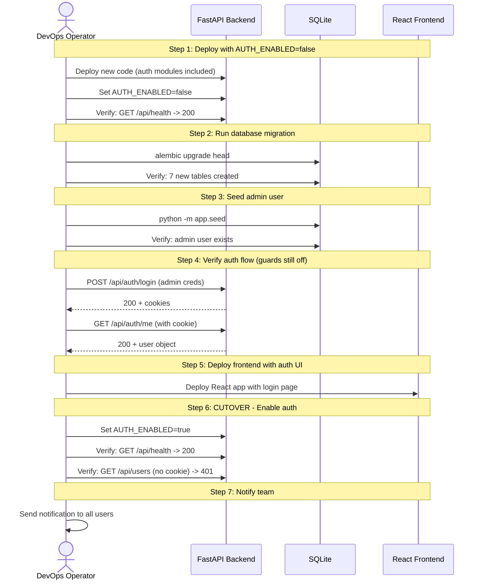

# RBAC — System Architecture & Flow Diagrams

## Iteration: RBAC | Visual Reference

> All diagrams use [Mermaid](https://mermaid.js.org/) syntax and render natively in GitHub, GitLab, and most modern markdown viewers.

---

## Table of Contents

1. [Component Architecture](#1-component-architecture)
2. [Database Entity-Relationship Diagram](#2-database-entity-relationship-diagram)
3. [Authentication Flow — Login](#3-authentication-flow--login)
4. [Authentication Flow — Protected Request](#4-authentication-flow--protected-request)
5. [Permission Resolution Flowchart](#5-permission-resolution-flowchart)
6. [Token Lifecycle State Diagram](#6-token-lifecycle-state-diagram)
7. [Department Access Resolution Diagram](#7-department-access-resolution-diagram)
8. [Role Hierarchy Diagram](#8-role-hierarchy-diagram)
9. [Frontend Route Protection Flow](#9-frontend-route-protection-flow)
10. [Cutover Deployment Sequence](#10-cutover-deployment-sequence)

---

## 1. Component Architecture

Shows all new modules alongside future ones and the dependency wires between them.

```mermaid
graph TB
    subgraph Frontend["React + Vite Frontend"]
        RG[React Router Guard\nRoute Protection]
        LP[/login\nLogin Page]
        AC[AuthContext\nUser State]
        SB[Sidebar.tsx\nRole-conditional nav]
        AD[/admin/dashboard\nAdmin Dashboard]
        FD[/faculty/dashboard\nFaculty Dashboard]
        SD[/student/dashboard\nStudent Dashboard]
        UMP[/admin/users\nUser Management]
        DMP[/admin/departments\nDept Management]
    end

    subgraph Backend["FastAPI Backend"]
        subgraph NEW["New Modules"]
            AR[auth/router.py\nlogin - logout - refresh - me]
            UR[users/router.py\nCRUD - bulk import]
            DR[departments/router.py\ndepartments - sections]
            FAR[assignments/router.py\nfaculty-section assignments]
        end

        subgraph MIDDLEWARE["Middleware & Dependencies"]
            RA[require_auth\nverifies JWT]
            RR[require_role\nrole check]
            RSA[require_section_access\ndepartment scoping]
            RSE[require_self_access\nstudent self-check]
        end

        subgraph FUTURE["Future Modules"]
            ATT[attendance/router.py\nmark - view - edit]
            ACA[academics/router.py\nmarks - grades]
            FEE[fees/router.py\npayments - status]
            ANN[announcements/router.py\ncreate - view]
        end
    end

    subgraph DB["SQLite Database"]
        subgraph NEWT["New Tables"]
            UT[(users)]
            RT[(refresh_tokens)]
            DT[(departments)]
            ST[(sections)]
            FSAT[(faculty_section_assignments)]
            SPT[(student_profiles)]
            FPT[(faculty_profiles)]
        end
        subgraph FUTURE_T["Future Tables"]
            ATT_T[(attendance_records)]
            MKT[(marks)]
            FEET[(fee_records)]
        end
    end

    RG -->|unauthenticated| LP
    AC -->|GET /auth/me| AR
    UMP --> UR
    DMP --> DR

    AR --> RA
    UR --> RA
    UR --> RR
    DR --> RA
    DR --> RR
    FAR --> RA
    FAR --> RR
    ATT --> RA
    ATT --> RSA
    ACA --> RA
    ACA --> RSA

    RA --> DB
    RR --> DB
    RSA --> DB
    AR --> DB
    UR --> DB
```

---

## 2. Database Entity-Relationship Diagram



---

## 3. Authentication Flow — Login



---

## 4. Authentication Flow — Protected Request



---

## 5. Permission Resolution Flowchart



---

## 6. Token Lifecycle State Diagram



---

## 7. Department Access Resolution Diagram

Concrete example: Faculty assignments at CEC.



---

## 8. Role Hierarchy Diagram



---

## 9. Frontend Route Protection Flow



---

## 10. Cutover Deployment Sequence


